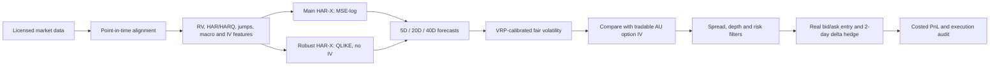

This project was jointly developed by **Edward Ji** (@EdwardBoyuanJi) and **Francis Ji** (@FrancisJi).

Both authors contributed equally to the research design, data engineering, model development, backtesting, implementation, and documentation.

# Shanghai Gold Volatility Forecasting & Options Research

[中文说明](README.zh-CN.md) · [Research report](docs/research_report_cn.pdf) · [Strategy manual](docs/strategy_manual_cn.pdf)

An end-to-end quantitative research project for forecasting Shanghai Futures Exchange gold (AU) realized volatility and translating the forecast into an executable options-volatility strategy.

The project covers point-in-time data engineering, 5/20/40-day volatility forecasts, leakage-controlled walk-forward validation, model comparison, volatility-risk-premium signals, real bid/ask execution rules, delta hedging, cost accounting, and a five-year strategy evaluation.

## Recruiter 60-second tour

1. Start with the [research design](#research-design) and [headline results](#headline-results).
2. Inspect the production-oriented modules in [src/au_rv](src/au_rv), especially [final model inference](src/au_rv/final_model/inference.py), [walk-forward validation](src/au_rv/models/walk_forward.py), and [real quote execution](src/au_rv/strategy_v6/real_execution.py).
3. Run the six frozen models with one command from [Quick start](#quick-start).
4. Review the test suite in [tests](tests), the public result tables in [results](results), and the detailed Chinese-language research report linked above.

## What I built

| Layer | Implementation |
|---|---|
| Data | TqSdk AU futures/options, Databento COMEX/OPRA, FRED macro/GVZ/EPU, and the GPR author dataset |
| Point-in-time controls | 15:05 Shanghai cutoff, release-vintage alignment, SHFE night-session mapping, non-overlapping COMEX windows, and contract-roll isolation |
| Features | HAR/HARQ, jump variation, macro, GVZ, SLV implied volatility, US EPU, GEPU, GPR, and scheduled-event counts |
| Forecasting | Separate 5/20/40-day coefficients under one dual-model interface; MSE-log main model plus IV-free QLIKE robustness model |
| Validation | Expanding walk-forward estimation, target-maturity embargo, time-series cross-validation, QLIKE, log-RV errors, OOS R-squared, direction accuracy, and DM tests |
| Trading | Forecast-to-IV edge, volatility-risk-premium calibration, spread filter, risk budget, visible-depth capacity, real bid/ask fills, and two-day delta hedging |
| Delivery | Frozen joblib models, CLI inference, local interactive dashboard, reproducible synthetic fixtures, audit tables, and tests |

## Headline results

### Forecast model

The final main model is HAR-X trained on log-RV MSE with macro, GVZ, SLV IV, and US EPU features. The robustness model is HAR-X trained directly on QLIKE with macro and US EPU, deliberately excluding all implied-volatility inputs to test whether the result is merely restating the options market.

| Horizon | Main QLIKE | Persistence QLIKE | Main OOS R-squared | Main direction accuracy | IV-free robust OOS R-squared |
|---:|---:|---:|---:|---:|---:|
| 5 days | 0.138 | 0.298 | 51.0% | 73.9% | 41.4% |
| 20 days | 0.201 | 0.460 | 53.1% | 76.4% | 48.6% |
| 40 days | 0.245 | 0.650 | 55.4% | 76.3% | 52.8% |

There are 861, 829, and 786 out-of-sample observations respectively. OOS R-squared is measured against the same-day persistence forecast. Direction accuracy asks whether the model correctly predicts whether future volatility will be above or below current realized volatility.

### Final strategy research result

The selected strategy uses a 10% per-trade risk budget, a maximum 25% relative straddle spread, five times displayed top-of-book depth as the capacity ceiling, and delta hedging every two trading days.

| Metric | Result |
|---|---:|
| Evaluation window | 2021-07-01 to 2026-07-27 |
| Initial research capital | CNY 10,000,000 |
| Net profit after modeled costs | CNY 509,760 |
| Total return | 5.10% |
| Annualized return | 1.02% |
| Sharpe ratio | 1.085 |
| Maximum drawdown | -0.91% |
| Closed option trades | 12 |
| Win rate | 83.3% |
| Profit factor | 15.59 |
| Total observed friction | CNY 117,990 |

Important: this is a sparse research strategy, not a production track record. The five-year calendar contains only 12 completed option trades, and 2021–2023 contain no trades because the full causal signal and quote filters did not produce eligible executions. The attractive Sharpe estimate therefore has substantial sampling uncertainty.

## Research design

The target is the log of average realized variance over the next 5, 20, or 40 SHFE trading days, beginning at t+1. Every training row is admitted only after its target window has matured. Feature transformations, scaling, regularization, and model selection are fitted inside each historical training window.

## Execution realism

- Option entries cross the observed top-of-book: buys at ask and sells at bid.
- Futures hedge buys execute at ask1 and sells at bid1.
- Hedge size cannot exceed the configured visible-depth capacity.
- Option commissions, exercise fees, futures commissions, and observed crossing costs are included.
- Signals are generated before the next execution window; no same-bar hindsight is used.
- Order and execution reconciliation is tested and separately audited.

The public repository contains derived summaries, not vendor raw quotes or tick histories. The full internal backtest can be reproduced only by a user with the required data licenses.

## Quick start

Python 3.12 is recommended.

    git clone https://github.com/FrancisJi/au-volatility-forecasting.git
    cd au-volatility-forecasting
    python3 -m venv .venv
    source .venv/bin/activate
    pip install -r requirements-lock.txt

Run the frozen 5/20/40-day model on the included feature snapshot:

    python scripts/33_predict_final_model.py --json
    python scripts/35_verify_final_prediction_model.py

Launch the local dashboard:

    python scripts/34_serve_final_model_dashboard.py

Then open http://127.0.0.1:8765.

Run the test suite:

    PYTHONPATH=src pytest -q

The repository also includes fully synthetic examples under [data/examples](data/examples). They demonstrate schemas and software behavior only; they are not market forecasts or performance evidence.

## Repository map

| Path | Purpose |
|---|---|
| [src/au_rv](src/au_rv) | Data, feature, model, evaluation, strategy, and execution modules |
| [scripts](scripts) | Numbered research pipeline from download through packaging |
| [tests](tests) | Unit and invariance tests, including leakage and execution checks |
| [models/final_prediction_model](models/final_prediction_model) | Six small frozen model bundles and hashes |
| [ui/final_model_dashboard](ui/final_model_dashboard) | Dependency-light local model interface |
| [results](results) | Derived model and strategy summaries; no raw vendor market data |
| [docs](docs) | Experiment reports, full research report, and final strategy manual |
| [data/examples](data/examples) | Synthetic fixtures safe for public distribution |

## Reproducibility boundaries

This repository intentionally excludes:

- credentials and local .env files;
- TqSdk, Databento, OPRA, and exchange raw data;
- raw bid/ask and tick histories;
- virtual environments, caches, and internal delivery archives.

The source code shows how those datasets are downloaded and transformed. To rerun the private-data pipeline, copy [.env.example](.env.example) to .env, supply your own licensed credentials, and review the vendor terms before downloading or redistributing data.

## Limitations and next steps

- Twelve trades are insufficient to establish a stable live Sharpe ratio.
- Five-times top-of-book depth is a capacity approximation, not full L2 queue simulation.
- The research does not model partial fills, cancel/replace latency, exchange outages, intraday margin calls, or broker-specific margin.
- Short straddles retain tail risk; a production version should test executable protective wings and hard portfolio loss limits.
- Model and strategy selection used the same broad research history. A frozen 6–12 month paper-trading period is the next required validation step.
- Historical results end on the dates stated above and are not live performance.

## Data, license, and disclaimer

Code is published for portfolio review and non-commercial research under the terms in [LICENSE](LICENSE). Third-party datasets remain subject to their original vendors' licenses and are not included. This repository is research software, not investment advice or a live trading system. Historical backtests are not guarantees of future performance.
